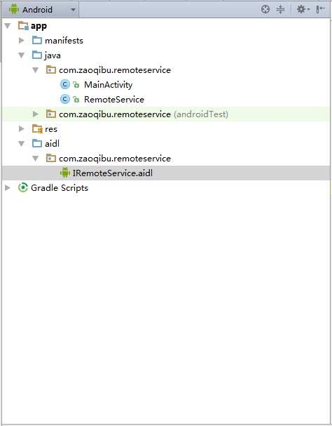
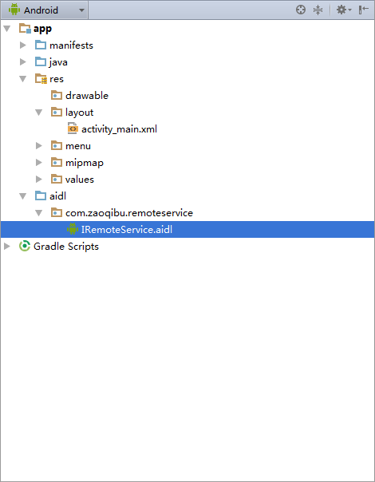
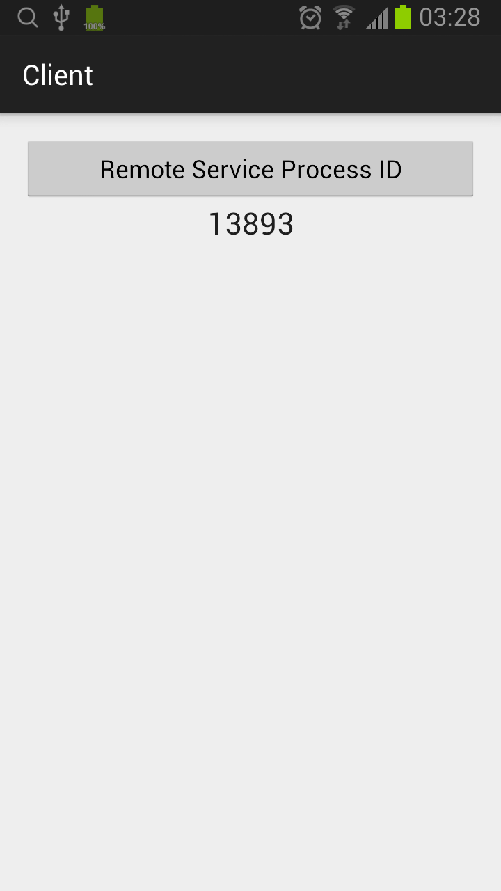

## AIDL - Primitive Types

### RemoteService

1. **定义 IRemoteService.aidl**

```java
package com.zaoqibu.remoteservice;

// Declare any non-default types here with import statements

interface IRemoteService {
    /** Request the process ID of this service, to do evil things with it. */
    int getPid();

    /** Demonstrates some basic types that you can use as parameters and return values in AIDL. */
    void basicTypes(int anInt, long aLong, boolean aBoolean, float aFloat, double aDouble, String aString);
}
```
* 定义了两个方法，输入和输出参数都是简单类型（int, long, boolean, float, double, String）。
* 编译程序，将会在 build/generated/ 目录下生成 IRemoteService.java 的文件，里面有 IRemoteService.Stub 服务的存根代理类。



2. **创建服务 RemoteService 类**

```java
public class RemoteService extends Service {
    private static final String TAG = "RemoteService";

    @Override
    public void onCreate() {
        super.onCreate();
    }

    @Override
    public IBinder onBind(Intent intent) {
        return binder;
    }

    private final IRemoteService.Stub binder = new IRemoteService.Stub() {
        public int getPid(){
            return Process.myPid();
        }

        public void basicTypes(int anInt, long aLong, boolean aBoolean,
                               float aFloat, double aDouble, String aString) {
            String str = String.format("anInt:%d, aLong:%d, aBoolean:%b, aFloat:%f, aDouble:%f, aString:%s",
                    anInt, aLong, aBoolean, aFloat, aDouble, aString);
            Log.i(TAG, str);
        }
    };

}
```

* 实现存根代理类 IRemoteService.Stub。

3. **在 AndroidManifest.xml 中声明 RemoteService**
```xml
        <service android:name=".RemoteService" android:process=":remote">
            <intent-filter>
                <!-- These are the interfaces supported by the service, which you can bind to. -->
                <action android:name="com.zaoqibu.remoteservice.IRemoteService" />
            </intent-filter>
        </service>
```

### Client

1. **从 RemoteService 工程中拷贝 IRemoteService.aidl 文件**



* 保持原路径

2. **调用 IRemoteService 方法。**

```java
public class MainActivity extends ActionBarActivity {
    private static final String TAG = "MainActivity";
    private IRemoteService iremoteService;

    @Override
    protected void onCreate(Bundle savedInstanceState) {
        super.onCreate(savedInstanceState);
        setContentView(R.layout.activity_main);

        bindService(new Intent(IRemoteService.class.getName()), serviceConnection, BIND_AUTO_CREATE);
    }

    private ServiceConnection serviceConnection = new ServiceConnection() {
        // Called when the connection with the service is established
        public void onServiceConnected(ComponentName className, IBinder service) {
            // Following the example above for an AIDL interface,
            // this gets an instance of the IRemoteInterface, which we can use to call on the service
            iremoteService = IRemoteService.Stub.asInterface(service);
        }

        // Called when the connection with the service disconnects unexpectedly
        public void onServiceDisconnected(ComponentName className) {
            Log.e(TAG, "Service has unexpectedly disconnected");
            iremoteService = null;
        }
    };

    public void onRemoteServiceProcessIDClick(View view) {
        int processID = 0;
        try {
            processID = iremoteService.getPid();

            iremoteService.basicTypes(1, 2, true, 3.3f, 4.4, "hello");
        } catch (RemoteException e) {
            e.printStackTrace();
        }

        TextView remoteServiceProcessID = (TextView)findViewById(R.id.remoteServiceProcessID);
        remoteServiceProcessID.setText(String.valueOf(processID));
    }

}
```


