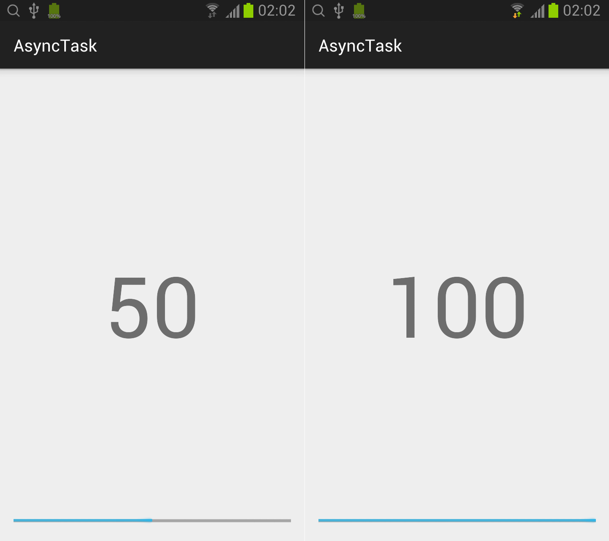

## Thread

### 在主界面布局（activity_main.xml）中增加 ProgressBar 和 TextView 控件。
```xml
<RelativeLayout xmlns:android="http://schemas.android.com/apk/res/android"
    xmlns:tools="http://schemas.android.com/tools"
    android:layout_width="match_parent"
    android:layout_height="match_parent"
    android:padding="@dimen/activity_vertical_margin"
    tools:context=".MainActivity">

    <ProgressBar
        style="?android:attr/progressBarStyleHorizontal"
        android:layout_width="match_parent"
        android:layout_height="wrap_content"
        android:id="@+id/progressBar"
        android:layout_alignParentBottom="true"
        android:layout_alignParentLeft="true"
        android:layout_alignParentStart="true" />

    <TextView
        android:layout_width="wrap_content"
        android:layout_height="wrap_content"
        android:id="@+id/textView"
        android:layout_centerVertical="true"
        android:layout_centerHorizontal="true"
        android:textSize="100sp"/>

</RelativeLayout>
```

### 在 MainActivity 中增加实现代码。
```java
public class MainActivity extends ActionBarActivity {
    final int maxValue = 10;
    CounterTask counterTask = null;

    private class CounterTask extends AsyncTask<Integer, Integer, Void> {
        @Override
        protected void onPreExecute() {
            ProgressBar progressBar = (ProgressBar)findViewById(R.id.progressBar);
            progressBar.setMax(maxValue);
            progressBar.setProgress(0);
        }

        @Override
        protected Void doInBackground(Integer... params) {
            int maxValue = params[0];
            for (int i=1; i<=maxValue; ++i) {
                try {
                    TimeUnit.SECONDS.sleep(1);
                } catch (InterruptedException e) {
                    e.printStackTrace();
                }

                publishProgress(i);

                if (isCancelled())
                    break;

                Log.i("examples", String.valueOf(i));
            }

            return null;
        }

        @Override
        protected void onProgressUpdate(Integer... values) {
            int curValue = values[0];

            ProgressBar progressBar = (ProgressBar)findViewById(R.id.progressBar);
            progressBar.setProgress(curValue);

            TextView textView = (TextView)findViewById(R.id.textView);
            textView.setText(String.valueOf(curValue * 100 / maxValue) + '%');
        }

        @Override
        protected void onPostExecute(Void aVoid) {

        }
    }

    @Override
    protected void onCreate(Bundle savedInstanceState) {
        super.onCreate(savedInstanceState);
        setContentView(R.layout.activity_main);

        counterTask = new CounterTask();
        counterTask.execute(maxValue);
    }

    @Override
    protected void onDestroy() {
        super.onDestroy();
        if (counterTask != null)
            counterTask.cancel(true);
    }
}
```

* 实现 AsyncTask 的方法
	* onPreExecute UI线程调用，任务执行前调用。
	* doInBackground 后台线程执行任务，参数类型由AsyncTask的第一个参数指定。调用 publishProgress 的参数类型由AsyncTask的第二个参数指定，由UI线程调用 onProgressUpdate。
	* onProgressUpdate UI线程调用，用于更新 UI，参数类型由AsyncTask的第二个参数指定。
	* onPostExecute UI线程调用，任务执行完成调用，参数类型由AsyncTask的第三个参数指定。
* CounterTask 的调用
	* 在UI类中 new CounterTask 类，调用 execute 方法，参数类型由AsyncTask的第一个参数指定。
	* 在 onDestroy 方法中调用异步任务的 cancel 方法。需要在异步任务的功能实现中使用 isCancelled 方法来结束任务的执行。

