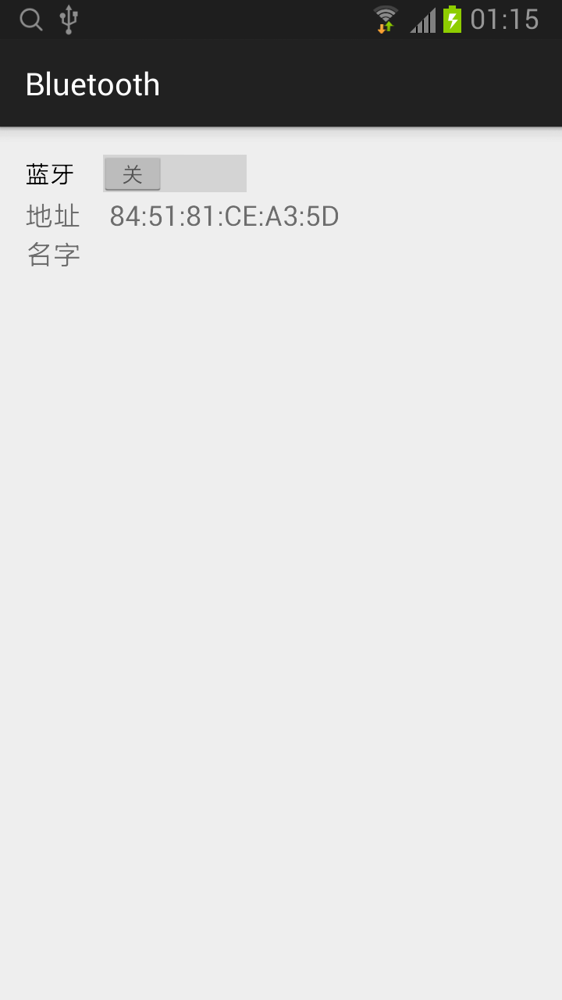
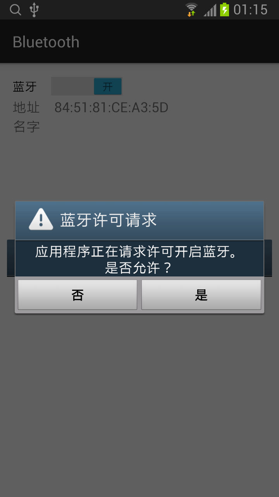
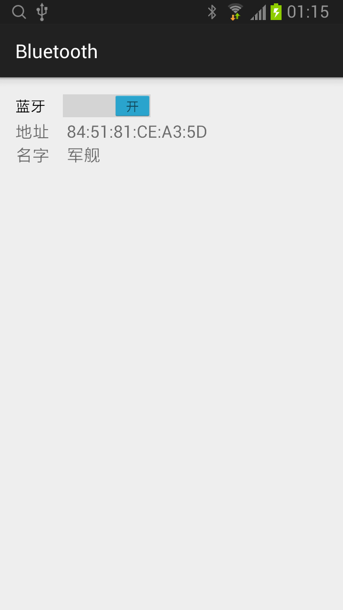

## Bluetooth 

### 主布局（activity_main.xml）
```xml
<RelativeLayout xmlns:android="http://schemas.android.com/apk/res/android"
    xmlns:tools="http://schemas.android.com/tools"
    android:layout_width="match_parent"
    android:layout_height="match_parent"
    android:padding="@dimen/activity_vertical_margin"
    tools:context=".MainActivity">

    <Switch
        android:layout_width="wrap_content"
        android:layout_height="wrap_content"
        android:text="蓝牙"
        android:id="@+id/switchBluetooth"
        android:onClick="onClickSwitchBluetooth"/>

    <TextView android:layout_width="wrap_content"
        android:layout_height="wrap_content"
        android:textAppearance="?android:attr/textAppearanceMedium"
        android:id="@+id/tvAddress_"
        android:text="地址　"
        android:layout_below="@+id/switchBluetooth"
        android:layout_alignParentLeft="true"
        android:layout_alignParentStart="true" />

    <TextView android:layout_width="wrap_content"
        android:layout_height="wrap_content"
        android:textAppearance="?android:attr/textAppearanceMedium"
        android:id="@+id/tvAddress"
        android:layout_alignTop="@+id/tvAddress_"
        android:layout_toRightOf="@+id/tvAddress_"
        android:layout_toEndOf="@+id/tvAddress_" />

    <TextView android:layout_width="wrap_content"
        android:layout_height="wrap_content"
        android:textAppearance="?android:attr/textAppearanceMedium"
        android:id="@+id/tvName_"
        android:text="名字　"
        android:layout_below="@+id/tvAddress_"
        android:layout_alignParentLeft="true"
        android:layout_alignParentStart="true" />

    <TextView android:layout_width="wrap_content"
        android:layout_height="wrap_content"
        android:textAppearance="?android:attr/textAppearanceMedium"
        android:id="@+id/tvName"
        android:layout_alignTop="@+id/tvName_"
        android:layout_toRightOf="@+id/tvName_"
        android:layout_toEndOf="@+id/tvName_" />

</RelativeLayout>
```

### MainActivity
```java
public class MainActivity extends ActionBarActivity {
    private BroadcastReceiver bluetoothStateChangeReceiver = null;
    private static final int BLUETOOTH_ENABLE = 1;

    @Override
    protected void onCreate(Bundle savedInstanceState) {
        super.onCreate(savedInstanceState);
        setContentView(R.layout.activity_main);

        initBluetoothUI();

        bluetoothStateChangeReceiver = new BroadcastReceiver() {
            @Override
            public void onReceive(Context context, Intent intent) {
                initBluetoothUI();
            }
        };

        registerReceiver(bluetoothStateChangeReceiver, new IntentFilter(BluetoothAdapter.ACTION_STATE_CHANGED));
    }

    private void initBluetoothUI() {
        BluetoothAdapter bluetoothAdapter = BluetoothAdapter.getDefaultAdapter();

        Switch switchBluetooth = (Switch)findViewById(R.id.switchBluetooth);
        switchBluetooth.setChecked(bluetoothAdapter.isEnabled());

        TextView tvAddress = (TextView)findViewById(R.id.tvAddress);
        tvAddress.setText(bluetoothAdapter.getAddress());

        if (bluetoothAdapter.isEnabled()) {
            TextView tvName = (TextView)findViewById(R.id.tvName);
            tvName.setText(bluetoothAdapter.getName());
        }
    }

    public void onClickSwitchBluetooth(View view) {
        Switch switchBluetooth = (Switch)findViewById(R.id.switchBluetooth);

        if (switchBluetooth.isChecked()) {
            startActivityForResult(new Intent(BluetoothAdapter.ACTION_REQUEST_ENABLE), BLUETOOTH_ENABLE);
        }
        else {
            BluetoothAdapter bluetoothAdapter = BluetoothAdapter.getDefaultAdapter();
            bluetoothAdapter.disable();
        }
    }

    @Override
    protected void onActivityResult(int requestCode, int resultCode, Intent data) {
        if (requestCode == BLUETOOTH_ENABLE && resultCode == RESULT_OK) {
            initBluetoothUI();
        }
    }

    @Override
    protected void onDestroy() {
        super.onDestroy();
        unregisterReceiver(bluetoothStateChangeReceiver);
    }
}
```
* 通过 BluetoothAdapter.getDefaultAdapter() 获得默认的蓝牙设备。使用 isEnable 方法来判断蓝牙设备的状态。
* 调用 enable 方法开启蓝牙设备，调用 disable 方法关闭蓝牙设备。一般开启使用 BluetoothAdapter.ACTION_REQUEST_ENABLE 请求 Activity，由用户来确认。
* 修改蓝牙设备的名字使用 setName 方法，需要 android.permission.BLUETOOTH_ADMIN 的权限。

### AndroidMenifest.xml 增加蓝牙的权限
```xml
<uses-permission android:name="android.permission.BLUETOOTH"/>
<uses-permission android:name="android.permission.BLUETOOTH_ADMIN"/>
```



