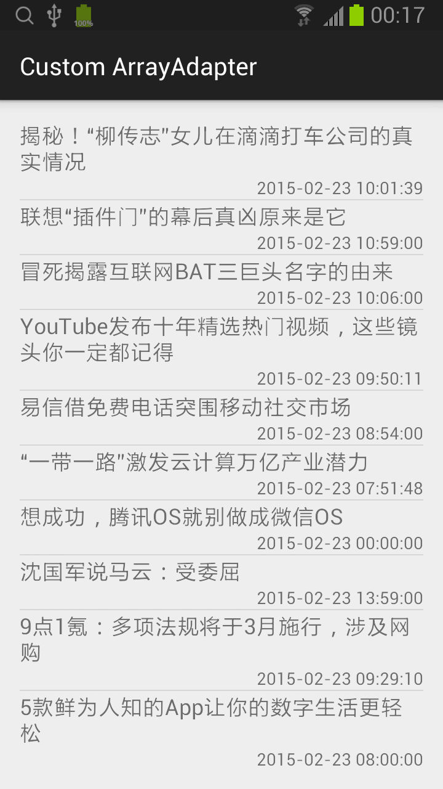

## Custom ArrayAdapter

### news.xml
```xml
<?xml version="1.0" encoding="utf-8"?>
<LinearLayout xmlns:android="http://schemas.android.com/apk/res/android"
    android:layout_width="match_parent"
    android:layout_height="match_parent"
    android:orientation="vertical">

    <TextView
        android:layout_width="match_parent"
        android:layout_height="wrap_content"
        android:textAppearance="?android:attr/textAppearanceMedium"
        android:id="@+id/tvNewsTitle"
        android:layout_above="@+id/tvNewsDate" />

    <TextView
        android:layout_width="wrap_content"
        android:layout_height="wrap_content"
        android:textAppearance="?android:attr/textAppearanceSmall"
        android:id="@+id/tvNewsDate"
        android:layout_gravity="right"/>

</LinearLayout>
```

### News.java
```java
public class News {
    private String title;
    private Date date;

    public News(String title, String date) {
        this.title = title;
        DateFormat dateFormat = new SimpleDateFormat("yyyy-MM-dd HH:mm:ss");
        try {
            this.date = dateFormat.parse(date);
        } catch (ParseException e) {
            e.printStackTrace();
        }
    }

    public String getTitle() {
        return title;
    }

    public String getDate() {
        DateFormat dateFormat = new SimpleDateFormat("yyyy-MM-dd HH:mm:ss");
        return dateFormat.format(date);
    }
}
```

### NewsArrayAdapter.java
```java
public class NewsArrayAdapter extends ArrayAdapter<News> {
    private int resource;
    private List<News> newses;

    public NewsArrayAdapter(Context context, int resource, List<News> objects) {
        super(context, resource, objects);
        this.resource = resource;
        this.newses = objects;
    }

    @Override
    public View getView(int position, View convertView, ViewGroup parent) {
        View view = convertView;

        // 方法1
        if (convertView == null) {
            LayoutInflater inflater = LayoutInflater.from(getContext());
            view = inflater.inflate(resource, parent, false);
        }

        // 方法2
//        if (view == null) {
//            LayoutInflater inflater = (LayoutInflater)getContext().getSystemService(Context.LAYOUT_INFLATER_SERVICE);
//            view = inflater.inflate(resource, parent, false);
//        }

        // 方法3
//        if (view == null) {
//            LayoutInflater inflater = (LayoutInflater)getContext().getSystemService(Context.LAYOUT_INFLATER_SERVICE);
//            view = inflater.inflate(resource, new LinearLayout(getContext()), true);
//        }

        News news = newses.get(position);

        TextView newsTitle = (TextView)view.findViewById(R.id.tvNewsTitle);
        newsTitle.setText(news.getTitle());

        TextView newsDate = (TextView)view.findViewById(R.id.tvNewsDate);
        newsDate.setText(news.getDate());

        return view;
    }
}
```
* 三种加载布局的方法

### activity_main.xml
```xml
<RelativeLayout xmlns:android="http://schemas.android.com/apk/res/android"
    xmlns:tools="http://schemas.android.com/tools" android:layout_width="match_parent"
    android:layout_height="match_parent" android:padding="@dimen/activity_vertical_margin"
    tools:context=".MainActivity">

    <ListView
        android:layout_width="match_parent"
        android:layout_height="match_parent"
        android:id="@+id/lvNewses" />

</RelativeLayout>
```

### MainActivity.java
```java
public class MainActivity extends ActionBarActivity {
    private List<News> newses;

    @Override
    protected void onCreate(Bundle savedInstanceState) {
        super.onCreate(savedInstanceState);
        setContentView(R.layout.activity_main);

        newses = new ArrayList<News>();

        newses.add(new News("揭秘！“柳传志”女儿在滴滴打车公司的真实情况", "2015-02-23 10:01:39"));
        newses.add(new News("联想“插件门”的幕后真凶原来是它", "2015-02-23 10:59:00"));
        newses.add(new News("冒死揭露​互联网​BAT三巨头名字的由来", "2015-02-23 10:06:00"));
        newses.add(new News("YouTube发布十年精选热门视频，这些镜头你一定都记得", "2015-02-23 09:50:11"));
        newses.add(new News("易信借免费电话突围移动社交市场", "2015-02-23 08:54:00"));
        newses.add(new News("“一带一路”激发云计算万亿产业潜力", "2015-02-23 07:51:48"));
        newses.add(new News("想成功，腾讯OS就别做成微信OS", "2015-02-23 00:00:00"));
        newses.add(new News("沈国军说马云：受委屈", "2015-02-23 13:59:00"));
        newses.add(new News("9点1氪：多项法规将于3月施行，涉及网购", "2015-02-23 09:29:10"));
        newses.add(new News("5款鲜为人知的App让你的数字生活更轻松", "2015-02-23 08:00:00"));

        ListView lvNewses = (ListView)findViewById(R.id.lvNewses);
        lvNewses.setAdapter(new NewsArrayAdapter(this, R.layout.news, newses));
    }

}
```


