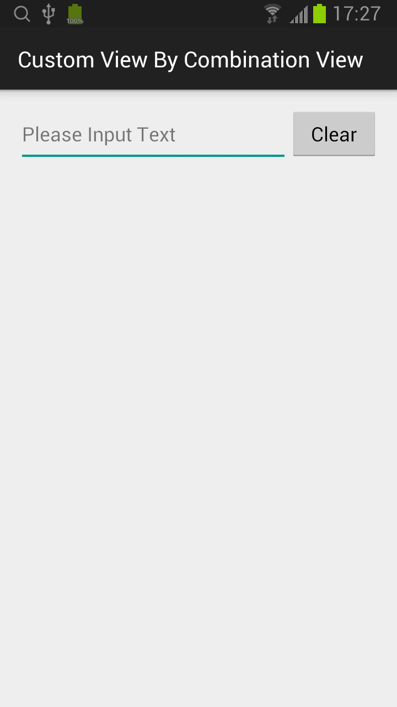

## Custom View By Combination View

### clearable_edit_text.xml
```xml
<LinearLayout xmlns:android="http://schemas.android.com/apk/res/android"
    xmlns:tools="http://schemas.android.com/tools" android:layout_width="match_parent"
    android:layout_height="wrap_content"
    android:orientation="horizontal"
    tools:context=".MainActivity">

    <EditText
        android:layout_width="match_parent"
        android:layout_height="wrap_content"
        android:hint="Please Input Text"
        android:id="@+id/editText"
        android:layout_weight="1"/>

    <Button
        android:layout_width="match_parent"
        android:layout_height="wrap_content"
        android:text="Clear"
        android:id="@+id/btnClear"
        android:layout_weight="3"/>

</LinearLayout>
```

### ClearableEditText.java
```java
public class ClearableEditText extends LinearLayout {
    private EditText editText;
    private Button clear;

    public ClearableEditText(Context context) {
        super(context);
        init();
    }

    public ClearableEditText(Context context, AttributeSet attrs) {
        super(context, attrs);
        init();
    }

    private void init() {
        LayoutInflater inflater = (LayoutInflater)getContext().getSystemService(Context.LAYOUT_INFLATER_SERVICE);
        inflater.inflate(R.layout.clearable_edit_text, this, true);

        editText = (EditText)findViewById(R.id.editText);
        clear = (Button)findViewById(R.id.btnClear);

        clear.setOnClickListener(new OnClickListener() {
            @Override
            public void onClick(View v) {
                editText.setText("");
            }
        });
    }

}
```
* 使用 inflate 加载布局。
* public ClearableEditText(Context context, AttributeSet attrs) 必须有。

### activity_main.xml
```xml
<LinearLayout xmlns:android="http://schemas.android.com/apk/res/android"
    xmlns:tools="http://schemas.android.com/tools" android:layout_width="match_parent"
    android:layout_height="match_parent" android:padding="@dimen/activity_vertical_margin"
    android:orientation="horizontal"
    tools:context=".MainActivity">

    <com.zaoqibu.customviewbycombinationview.ClearableEditText
        android:id="@+id/clearableEditText"
        android:layout_width="match_parent"
        android:layout_height="wrap_content"/>

</LinearLayout>
```

### MainActivity.java
```java
public class MainActivity extends ActionBarActivity {

    @Override
    protected void onCreate(Bundle savedInstanceState) {
        super.onCreate(savedInstanceState);
        setContentView(R.layout.activity_main);
    }

}
```


