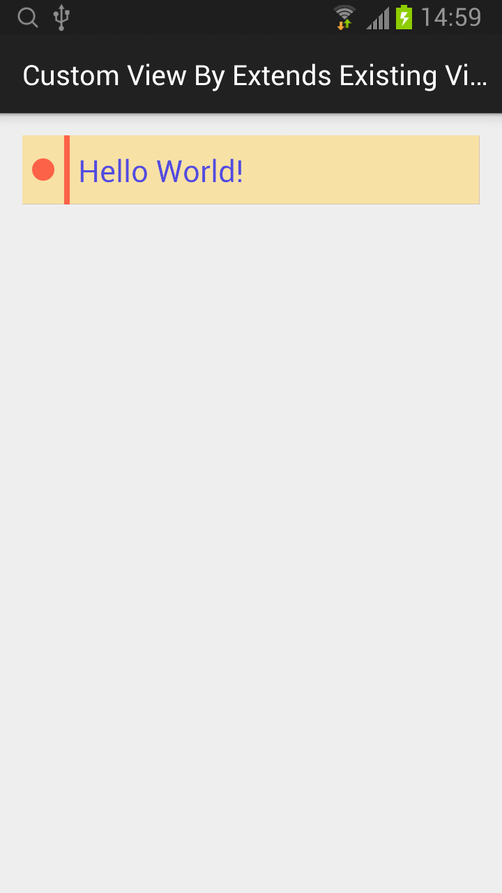

## Custom View By Extends Existing View

### colors.xml
```xml
<?xml version="1.0" encoding="utf-8"?>
<resources>
    <color name="paper">#EEF8E0A0</color>
    <color name="lines">#FF0000FF</color>
    <color name="margin">#90FF0000</color>
    <color name="text">#AA0000FF</color>
</resources>
```

### dimens.xml
```xml
<resources>
    <dimen name="margin">30dp</dimen>
    <dimen name="radius">8dp</dimen>
    <dimen name="rect_width">4dp</dimen>
</resources>
```

### CustomTextView.java
```java
public class CustomTextView extends TextView {
    private float margin;
    private float radius;
    private float rectWidth;
    
    private int paperColor;
    private Paint linesPaint;
    private Paint marginPaint;

    public CustomTextView(Context context) {
        super(context);
        init();
    }

    public CustomTextView(Context context, AttributeSet attrs) {
        super(context, attrs);
        init();
    }

    public CustomTextView(Context context, AttributeSet attrs, int defStyleAttr) {
        super(context, attrs, defStyleAttr);
        init();
    }

    private void init() {
        Resources resources = getResources();

        margin = resources.getDimension(R.dimen.margin);
        radius = resources.getDimension(R.dimen.radius);
        rectWidth = resources.getDimension(R.dimen.rect_width);

        paperColor = resources.getColor(R.color.paper);

        linesPaint = new Paint(Paint.ANTI_ALIAS_FLAG);
        linesPaint.setColor(resources.getColor(R.color.lines));

        marginPaint = new Paint(Paint.ANTI_ALIAS_FLAG);
        marginPaint.setColor(resources.getColor(R.color.margin));
    }

    @Override
    protected void onDraw(Canvas canvas) {
        // 画背景
        canvas.drawColor(paperColor);

        // 画简单的阴影
        canvas.drawLine(getMeasuredWidth(), 0, getMeasuredWidth(), getMeasuredHeight(), linesPaint);
        canvas.drawLine(0, getMeasuredHeight(), getMeasuredWidth(), getMeasuredHeight(), linesPaint);

        // 画矩形
        canvas.drawRect(margin, 0, margin+rectWidth, getMeasuredHeight(), marginPaint);

        // 画圆
        canvas.drawCircle(margin/2, getMeasuredHeight()/2, radius, marginPaint);

        canvas.save();

        // 设置新的坐标原点
        canvas.translate(margin, 0);
        // 使用新的坐标原点绘制文本
        super.onDraw(canvas);

        canvas.restore();
    }
}
```
* 坐标原点默认 (0, 0)，在左上角。

### activity_main.xml
```xml
<RelativeLayout xmlns:android="http://schemas.android.com/apk/res/android"
    xmlns:tools="http://schemas.android.com/tools" android:layout_width="match_parent"
    android:layout_height="match_parent" android:padding="@dimen/activity_vertical_margin"
    tools:context=".MainActivity">

    <com.zaoqibu.customviewbyextendsexistingview.CustomTextView
        android:layout_width="match_parent"
        android:layout_height="wrap_content"
        android:padding="10dp"
        android:textAppearance="?android:textAppearanceLarge"
        android:text="Hello World!"
        android:textColor="@color/text"/>

</RelativeLayout>
```


