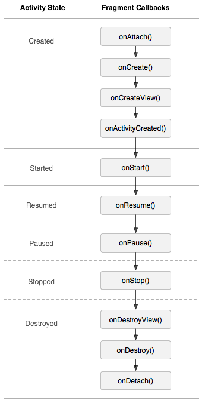

## Fragment Lifecycle

### Fragment 生命周期


### Activity Fragment 生命周期


### 运行结果
```
Activity﹕ onCreate Enter
	Fragment﹕ onAttach Enter
	Fragment﹕ onAttach Leave
	Fragment﹕ onCreate Enter
	Fragment﹕ onCreate Leave
	Fragment﹕ onCreateView Enter
	Fragment﹕ onCreateView Leave
Activity﹕ onCreate Leave
Fragment﹕ onActivityCreated Enter
Fragment﹕ onActivityCreated Leave
Activity﹕ onStart Enter
Activity﹕ onStart Leave
Fragment﹕ onStart Enter
Fragment﹕ onStart Leave
Activity﹕ onResume Enter
Activity﹕ onResume Leave
Fragment﹕ onResume Enter
Fragment﹕ onResume Leave
Fragment﹕ onPause Enter
Fragment﹕ onPause Leave
Activity﹕ onPause Enter
Activity﹕ onPause Leave
Fragment﹕ onStop Enter
Fragment﹕ onStop Leave
Activity﹕ onStop Enter
Activity﹕ onStop Leave
Fragment﹕ onDestroyView Enter
Fragment﹕ onDestroyView Leave
Fragment﹕ onDestroy Enter
Fragment﹕ onDestroy Leave
Fragment﹕ onDetach Enter
Fragment﹕ onDetach Leave
Activity﹕ onDestroy Enter
Activity﹕ onDestroy Leave
```