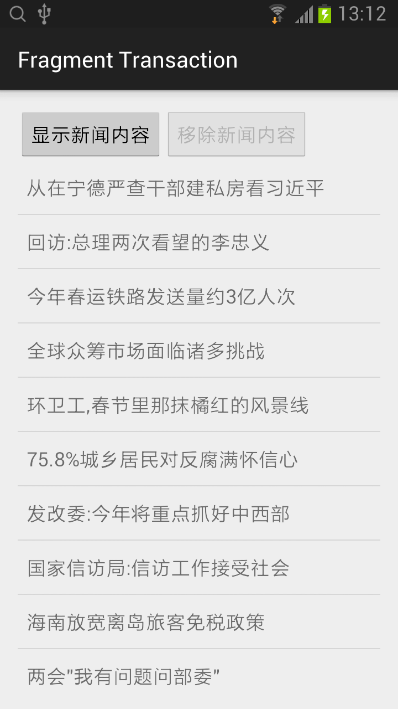
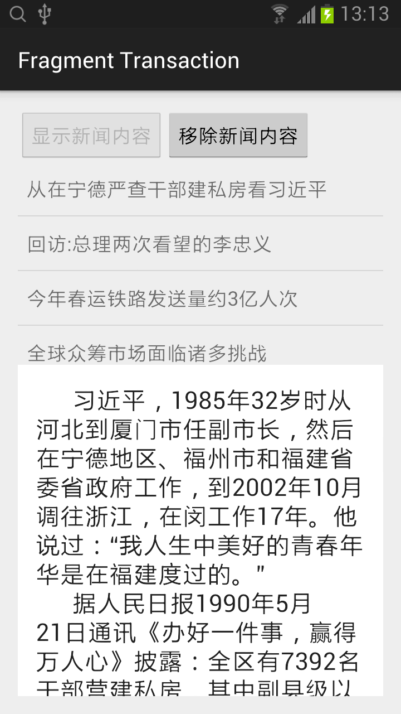

## Fragment Transaction

### 添加、删除和替换 Fragment
```java
FragmentManager fm = getFragmentManager();
FragmentTransaction fragmentTransaction = fm.beginTransaction();
// 添加、删除、替换
// 增加动画
// 添加到 back 栈
fragmentTransaction.commit();
```

### 例子
#### activity_main.xml
```xml
<LinearLayout xmlns:android="http://schemas.android.com/apk/res/android"
    xmlns:tools="http://schemas.android.com/tools" android:layout_width="match_parent"
    android:layout_height="match_parent" android:padding="@dimen/activity_vertical_margin"
    android:orientation="vertical"
    tools:context=".MainActivity">

    <LinearLayout
        android:layout_width="match_parent"
        android:layout_height="wrap_content">
        <Button
            android:layout_width="wrap_content"
            android:layout_height="wrap_content"
            android:id="@+id/btnShowNewsContent"
            android:text="显示新闻内容"
            android:onClick="onShowNewsContentClick"/>
        <Button
            android:layout_width="wrap_content"
            android:layout_height="wrap_content"
            android:id="@+id/btnRemoveNewsContent"
            android:text="移除新闻内容"
            android:onClick="onRemoveNewsContentClick"/>
    </LinearLayout>

    <FrameLayout
        android:id="@+id/news_title_list_container"
        android:layout_width="match_parent"
        android:layout_height="match_parent"
        android:layout_weight="3"/>

    <FrameLayout
        android:id="@+id/news_content_container"
        android:layout_width="match_parent"
        android:layout_height="match_parent"
        android:layout_weight="2"
        android:visibility="gone"/>
</LinearLayout>
```
* visibility="gone" 不占用空间，这样 news_title_list_container 就可以占用整个布局。

#### fragment_news_title_list.xml
```xml
<?xml version="1.0" encoding="utf-8"?>
<LinearLayout xmlns:android="http://schemas.android.com/apk/res/android"
    android:orientation="vertical" android:layout_width="match_parent"
    android:layout_height="match_parent">

    <ListView
        android:layout_width="match_parent"
        android:layout_height="match_parent"
        android:id="@android:id/list" />

</LinearLayout>
```

#### fragment_news_content.xml
```xml
<?xml version="1.0" encoding="utf-8"?>
<LinearLayout xmlns:android="http://schemas.android.com/apk/res/android"
    android:orientation="vertical" android:layout_width="match_parent"
    android:layout_height="match_parent"
    android:background="@android:color/white">

    <ScrollView
        android:layout_width="match_parent"
        android:layout_height="match_parent">
        <TextView
            android:layout_width="match_parent"
            android:layout_height="match_parent"
            android:padding="@dimen/activity_horizontal_margin"
            android:textAppearance="?android:attr/textAppearanceLarge"
            android:id="@+id/tvNewsContent" />
    </ScrollView>

</LinearLayout>
```

#### MainActivity.java
```java
public class MainActivity extends ActionBarActivity implements NewsTitleListFragment.OnNewsSelectedListener {
    private NewsContentFragment newsContentFragment;

    @Override
    protected void onCreate(Bundle savedInstanceState) {
        super.onCreate(savedInstanceState);
        setContentView(R.layout.activity_main);

        findViewById(R.id.btnShowNewsContent).setEnabled(true);
        findViewById(R.id.btnRemoveNewsContent).setEnabled(false);

        FragmentManager fm = getFragmentManager();
        FragmentTransaction fragmentTransaction = fm.beginTransaction();
        fragmentTransaction.add(R.id.news_title_list_container, new NewsTitleListFragment());
//        fragmentTransaction.add(R.id.news_content_container, new NewsContentFragment());
        fragmentTransaction.commit();
    }

    public void onShowNewsContentClick(View view) {
        if (newsContentFragment == null) {
            newsContentFragment = new NewsContentFragment();
        }

        FragmentManager fm = getFragmentManager();
        FragmentTransaction fragmentTransaction = fm.beginTransaction();
        fragmentTransaction.add(R.id.news_content_container, newsContentFragment);
        fragmentTransaction.setTransition(FragmentTransaction.TRANSIT_FRAGMENT_OPEN);
//        fragmentTransaction.setCustomAnimations(R.anim.abc_slide_in_bottom, R.anim.abc_slide_out_top);
        fragmentTransaction.commit();

        findViewById(R.id.news_content_container).setVisibility(View.VISIBLE);
        findViewById(R.id.btnShowNewsContent).setEnabled(false);
        findViewById(R.id.btnRemoveNewsContent).setEnabled(true);

    }

    public void onRemoveNewsContentClick(View view) {
        FragmentManager fm = getFragmentManager();
        FragmentTransaction fragmentTransaction = fm.beginTransaction();
        fragmentTransaction.remove(newsContentFragment);
        fragmentTransaction.setTransition(FragmentTransaction.TRANSIT_FRAGMENT_CLOSE);
//        fragmentTransaction.setCustomAnimations(R.anim.abc_slide_in_top, R.anim.abc_slide_out_bottom);
        fragmentTransaction.commit();

        findViewById(R.id.btnRemoveNewsContent).setEnabled(false);
        findViewById(R.id.btnShowNewsContent).setEnabled(true);
        findViewById(R.id.news_content_container).setVisibility(View.GONE);
    }

    @Override
    public void onNewsSelected(News news) {
        if (newsContentFragment != null)
            newsContentFragment.setNewsContent(news.getContent());
    }
}
```
* Fragment 使用动画的两种方法。
  * 1. fragmentTransaction.setTransition(FragmentTransaction.TRANSIT_FRAGMENT_OPEN);
  * 2. fragmentTransaction.setCustomAnimations(R.anim.abc_slide_in_bottom, R.anim.abc_slide_out_top);

#### NewsTitleListFragment.java
```java
public class NewsTitleListFragment extends ListFragment {
    private  OnNewsSelectedListener onNewsSelectedListener;
    private List<News> newses = new ArrayList<News>();

    public NewsTitleListFragment() {
        newses.add(new News("从在宁德严查干部建私房看习近平", "      习近平，1985年32岁时从河北到厦门市任副市长，然后在宁德地区、福州市和福建省委省政府工作，到2002年10月调往浙江，在闵工作17年。他说过：“我人生中美好的青春年华是在福建度过的。”\n      据人民日报1990年5月21日通讯《办好一件事，赢得万人心》披露：全区有7392名干部营建私房，其中副县级以上的干部达242人，科级以上的干部1399人，分别占这两级干部总数的49％和46％。“这是一组与贫困地区形成强烈反差令人触目惊心的数字！”"));
        newses.add(new News("回访:总理两次看望的李忠义", "      去年以来，李克强总理14次到基层调研考察。影像记录下大量总理与普通人交流的画面。我们从中定格了少数一些总理与普通人交流的“历史瞬间”，并对画面中那些普通人进行了回访。\n      通过回访这些普通人与总理握手之后的故事，或许可以拼出一张民众视角的\"总理考察地图\"，也可从另一个角度，观察去年以来中国变革足迹。"));
        newses.add(new News("今年春运铁路发送量约3亿人次", "      今年春运，我国动车组列车开行范围扩至28个省区市，高铁运力已占铁路春运运力的半壁江山。春运迈入高铁时代，作为乘客的您，准备好了吗？\n      其实，高铁上抽烟，后果很严重。我国高铁列车内都装有烟雾自动报警器，对任何烟雾都会及时报警，列车将直接降速，达到危险程度还会停车。据南宁客运段南宁东至杭州G1506次列车长许阳星介绍，动车组开车后，车上都有安全宣传，相关事项不仅要随时广播提示、显示屏上滚动播放，乘务员也会进行宣传。“高铁实行公交化发车，发车间隔很短，三五分钟一趟车。如果前车降速或停运将直接导致后续车辆晚点，并威胁线路的整体运营安全。”"));
        newses.add(new News("全球众筹市场面临诸多挑战", "      一项新奇的创意，一群“任性的”（仅凭兴趣）的投资者，通过一个互联网融资平台就能让项目发起方筹得实现自己目标和梦想的资金或资源，这就是时下风靡全球的众筹。作为互联网金融创新的一种重要形式，众筹起源于美国，随后向加拿大、欧洲等地迅速发展，中国等新兴市场更不可小觑。据世界银行统计，2013年全球众筹融资总额已达51亿美元，其中欧美市场占90%；预计到2025年其总额将突破960亿美元，亚洲市场所占比重有望大幅提高。"));
        newses.add(new News("环卫工,春节里那抹橘红的风景线", "      爆竹声里迎新年，走亲访友，逛街购物，每个人都尽情享受着节日的喜庆。然而今年回家的游子们都会发觉，巢湖市和以往有些不同。\n      “今年回家明显感到家乡干净多了。”从深圳回来的孙伟感叹，以往过年时，那些大街上的垃圾去哪了？\n      其实，只要稍加留意就不难发现，每隔几百米就有一位身穿橘红色马甲、头戴橘红色小帽的环卫工在不停地弯腰扫地，低头捡垃圾。春节假期，他们也和平常一样，凌晨3点多就开始打扫，一忙就是大半天。很多人是在马路上迎来了新春第一缕阳光。"));
        newses.add(new News("75.8%城乡居民对反腐满怀信心", "      2014年，75.8%的城乡居民对反腐败表示有信心或比较有信心。2012年，这个数据是60%。\n      两年时间提高15.8个百分点——中国社科院中国廉政研究中心组织的问卷调查结果显示，广大干部群众对反腐败的信心有了大幅度提升。\n      这一直观而又积极的变化，显示出我们党将正风反腐进行到底的政治决心和政治定力得到广泛认同，有腐必反、有贪必肃的成果深得党心民心。"));
        newses.add(new News("发改委:今年将重点抓好中西部", "      据介绍，２０１４年发展改革委共下达中央预算内投资３４０亿元用于交通基础设施建设，全年新开工铁路项目６６个，国家高速公路“断头路”项目２０个，普通国道“瓶颈路段”项目２１个，水路项目１２个，支线机场项目９个。\n　　 到２０１４年底，全国铁路运营里程达到１１万公里，公路通车里程达到４４６万公里，沿海港口（含长江南京以下港口）２１１６个，通航的民用运输机场２０２个。全国有２１个城市开通城市轨道交通线路，运营总里程超过２８００公里。高速铁路运营里程达到１．５８万公里，位列世界第一，高速铁路服务范围覆盖２８个省区市，实现网络化运营。"));
        newses.add(new News("国家信访局:信访工作接受社会", "      2月10日，国务院副秘书长、国家信访局党组书记、局长舒晓琴在国家信访局机关2015年党风廉政建设工作会议上强调，国家信访局要在提高工作透明度上狠下功夫，进一步推动阳光信访，坚决消除滋生腐败的重大隐患。"));
        newses.add(new News("海南放宽离岛旅客免税政策", "      据人民日报报道 为进一步发挥海南离岛旅客免税购物政策效应，大力推动海南国际旅游岛建设，财政部经商国家发改委、商务部、税务总局等部门，并报国务院批准，决定自2015年3月20日起，调整完善离岛免税政策部分内容。"));
        newses.add(new News("两会\"我有问题问部委\"", "      建议取消职称评聘，因为在中小学大家的水平差不多，谁也不比谁强多少，能评上的，无外乎是凭资格、凭权利，凭人脉......没有公平、没有公正、更没有正义可言。而一旦评上中小学高级职称的，工资立即落别人700元左右，差距实在太大，造成人心的不平衡。如果还要继续进行职称评聘，级别工资差不要突破100元，而且，退休后就应收回职称工资。"));
    }

    @Override
    public void onAttach(Activity activity) {
        super.onAttach(activity);
        onNewsSelectedListener = (OnNewsSelectedListener)activity;
    }

    @Override
    public void onCreate(Bundle savedInstanceState) {
        super.onCreate(savedInstanceState);

        setListAdapter(new ArrayAdapter<String>(getActivity(),
                android.R.layout.simple_list_item_1, getNewsTitles()));
    }

    private List<String> getNewsTitles() {
        List<String> newsTitles = new ArrayList<String>();

        for (News news : newses) {
            newsTitles.add(news.getTitle());
        }

        return newsTitles;
    }

    @Override
    public void onListItemClick(ListView l, View v, int position, long id) {
        super.onListItemClick(l, v, position, id);

        News news = newses.get(position);
        onNewsSelectedListener.onNewsSelected(news);
    }

    public interface OnNewsSelectedListener {
        public void onNewsSelected(News news);
    }
}
```
* 定义 OnNewsSelectedListener 事件接口，用于与 Activity 交互。

#### NewsContentFragment.java
```java
public class NewsContentFragment extends Fragment {

    @Nullable
    @Override
    public View onCreateView(LayoutInflater inflater, ViewGroup container, Bundle savedInstanceState) {
        return inflater.inflate(R.layout.fragment_news_content, container, false);
    }

    public void setNewsContent(String newsContent) {
        if (getView() != null) {
            TextView tvNewsContent = (TextView) getView().findViewById(R.id.tvNewsContent);
            tvNewsContent.setText(newsContent);
        }
    }

}
```

#### News.java
```java
public class News {
    private String title;
    private String content;

    public News(String title, String content) {
        this.title = title;
        this.content = content;
    }

    public String getTitle() {
        return title;
    }

    public String getContent() {
        return content;
    }
}
```



