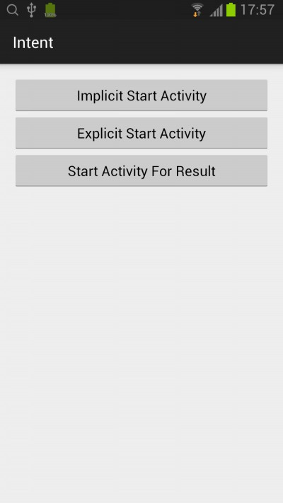
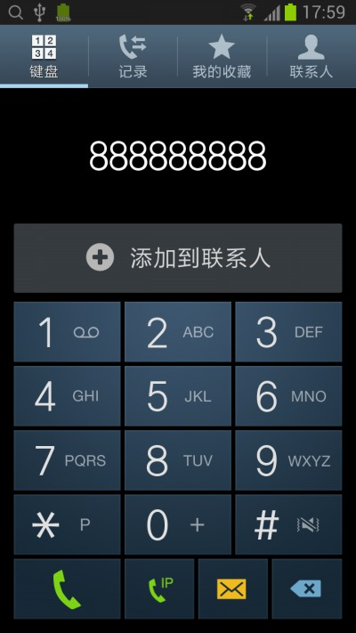

## Intent

### 1. 显示启动 Activity
```java
  Intent intent = new Intent(this, HelloActivity.class);
  startActivity(intent);
```



### 2. 隐式启动 Activity
```java
  Intent intent = new Intent(Intent.ACTION_DIAL, Uri.parse("tel:888888888"));
  startActivity(intent);
```



### 3. 从 Activity 返回结果

#### MainActivity.java
```java
public class MainActivity extends ActionBarActivity {
    private static final String TAG = "MainActivity";
    private static final int ACTION_LGOIN = 1;

    @Override
    protected void onCreate(Bundle savedInstanceState) {
        super.onCreate(savedInstanceState);
        setContentView(R.layout.activity_main);
    }

    public void onStartActivityForResultClick(View view) {
        Intent intent = new Intent(this, LoginActivity.class);
        startActivityForResult(intent, ACTION_LGOIN);
    }

    @Override
    protected void onActivityResult(int requestCode, int resultCode, Intent data) {
        super.onActivityResult(requestCode, resultCode, data);

        if (requestCode == ACTION_LGOIN && resultCode == RESULT_OK) {
            Bundle extras = data.getExtras();

            Log.i(TAG, extras.get(LoginActivity.EMAIL).toString());
            Log.i(TAG, extras.get(LoginActivity.PASSWORD).toString());
        }
    }
}
```
* 要调用 startActivityForResult 方法，传入一个请求代码。请求代码不能定义为 -1，如果是 -1 等同于调用 startActivity 方法。
* 重写 onActivityResult 方法。要判断 requestCode，可以会处理多个请求码。如果 resultCode == RESULT_CANCEL，data 将返回 null。

#### activity_login.xml
```xml
<LinearLayout xmlns:android="http://schemas.android.com/apk/res/android"
    xmlns:tools="http://schemas.android.com/tools"
    android:layout_width="match_parent"
    android:layout_height="match_parent"
    android:padding="@dimen/activity_vertical_margin"
    android:orientation="vertical"
    tools:context="com.zaoqibu.intent.LoginActivity">


    <EditText
        android:layout_width="match_parent"
        android:layout_height="wrap_content"
        android:hint="Email"
        android:id="@+id/etEmail" />

    <EditText
        android:layout_width="match_parent"
        android:layout_height="wrap_content"
        android:inputType="textPassword"
        android:ems="10"
        android:hint="Password"
        android:id="@+id/etPassword" />

    <Button
        android:layout_width="match_parent"
        android:layout_height="wrap_content"
        android:text="Login"
        android:id="@+id/btnLogin"
        android:onClick="onLoginClick"/>

</LinearLayout>
```

#### LoginActivity.java
```java
public class LoginActivity extends ActionBarActivity {
    public static final String EMAIL = "Email";
    public static final String PASSWORD = "Password";

    @Override
    protected void onCreate(Bundle savedInstanceState) {
        super.onCreate(savedInstanceState);
        setContentView(R.layout.activity_login);
    }

    public void onLoginClick(View view) {
        EditText etEmail = (EditText)findViewById(R.id.etEmail);
        EditText etPassword = (EditText)findViewById(R.id.etPassword);

        Intent data = new Intent();
        data.putExtra(EMAIL, etEmail.getText().toString());
        data.putExtra(PASSWORD, etPassword.getText().toString());

        setResult(RESULT_OK, data);

        finish();
    }
}
```
* setResult 返回结果
* finish 关闭当前的 Activity


### 参考
[Intent](http://developer.android.com/reference/android/content/Intent.html)
[Intents and Intent Filters](http://developer.android.com/guide/components/intents-filters.html)
