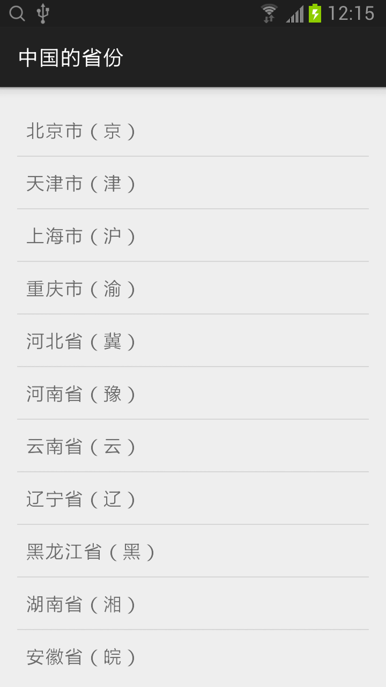

## ListFragment

### 1. 创建 ListFragment 对应的布局（provinces_listfragment.xml）。
```xml
<?xml version="1.0" encoding="utf-8"?>
<LinearLayout xmlns:android="http://schemas.android.com/apk/res/android"
    android:orientation="vertical" android:layout_width="match_parent"
    android:layout_height="match_parent">

    <ListView
        android:id="@id/android:list"
        android:layout_width="match_parent"
        android:layout_height="match_parent"
        android:drawSelectorOnTop="false"/>
</LinearLayout>
```

* android:drawSelectorOnTop="false" 点击某条记录不放，颜色会在记录的后面，成为背景色，但是记录内容的文字是可见的。

### 2. 继承 ListFragment 类，创建 ProvincesListFragment，增加了单击响应事件。
```java
public class ProvincesListFragment extends ListFragment {
    String [] provincesOfChina = {"北京市（京）","天津市（津）","上海市（沪）","重庆市（渝）","河北省（冀）",
            "河南省（豫）","云南省（云）","辽宁省（辽）","黑龙江省（黑）","湖南省（湘）",
            "安徽省（皖）","山东省（鲁）","新疆维吾尔（新）","江苏省（苏）","浙江省（浙）",
            "江西省（赣）","湖北省（鄂）","广西壮族（桂）","甘肃省（甘）","山西省（晋）",
            "内蒙古（蒙）","陕西省（陕）","吉林省（吉）","福建省（闽）","贵州省（贵）",
            "广东省（粤）","青海省（青）","西藏（藏）","四川省（川）","宁夏回族（宁）",
            "海南省（琼）","台湾省（台）","香港特别行政区","澳门特别行政区"};

    @Override
    public View onCreateView(LayoutInflater inflater, ViewGroup container, Bundle savedInstanceState) {
        return inflater.inflate(R.layout.provinces_listfragment, container, false);
    }

    @Override
    public void onCreate(Bundle savedInstanceState) {
        super.onCreate(savedInstanceState);

        setListAdapter(new ArrayAdapter<String>(this.getActivity(), android.R.layout.simple_list_item_1, provincesOfChina));
    }

    @Override
    public void onListItemClick(ListView l, View v, int position, long id) {
        super.onListItemClick(l, v, position, id);

        Toast.makeText(this.getActivity(), provincesOfChina[position], Toast.LENGTH_SHORT).show();
    }
}
```

* Toast 快速显示少量信息，提示用户。

### 3. 主活动布局中增加 fragment 标签，引入新增的 ProvincesListFragment。
```xml
<RelativeLayout xmlns:android="http://schemas.android.com/apk/res/android"
    xmlns:tools="http://schemas.android.com/tools" android:layout_width="match_parent"
    android:layout_height="match_parent" android:paddingLeft="@dimen/activity_horizontal_margin"
    android:paddingRight="@dimen/activity_horizontal_margin"
    android:paddingTop="@dimen/activity_vertical_margin"
    android:paddingBottom="@dimen/activity_vertical_margin" tools:context=".MainActivity">

    <fragment
        android:name="com.zaoqibu.listfragmentexample.ProvincesListFragment"
        android:id="@+id/my_fragment"
        android:layout_width="match_parent"
        android:layout_height="match_parent"/>
</RelativeLayout>
```

## 例子：中国的省份

