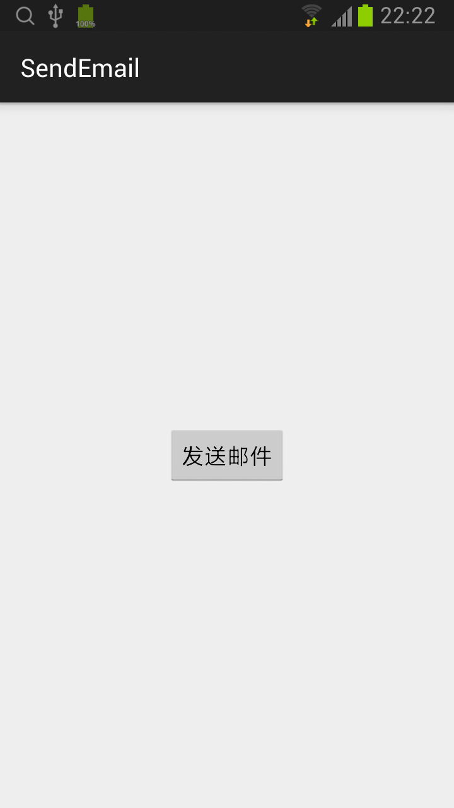
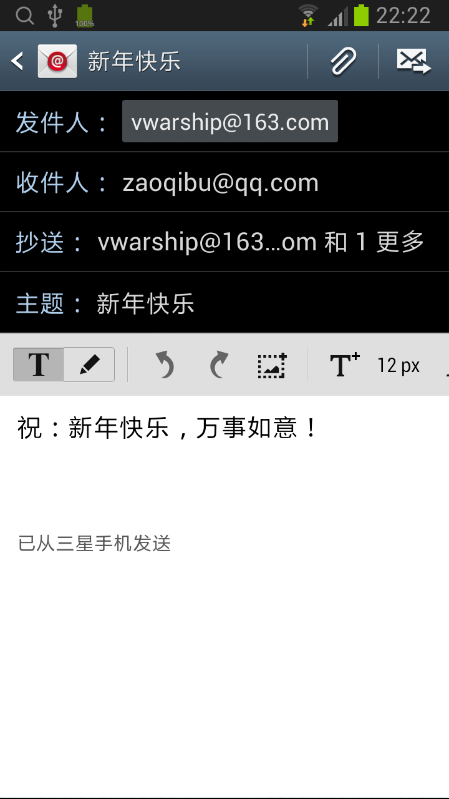

## Send Email

* 1. 在 activity_main.xml 中增加发送邮件的按钮。
```xml
<RelativeLayout xmlns:android="http://schemas.android.com/apk/res/android"
    xmlns:tools="http://schemas.android.com/tools" android:layout_width="match_parent"
    android:layout_height="match_parent" tools:context=".MainActivity">

    <Button
        android:layout_width="wrap_content"
        android:layout_height="wrap_content"
        android:text="发送邮件"
        android:id="@+id/btn_send_email"
        android:onClick="onClick"
        android:layout_centerVertical="true"
        android:layout_centerHorizontal="true" />
</RelativeLayout>
```

* 2. 在 MainActivity 中增加发送邮件按钮的单击响应事件。
```java
public void onClick(View v) {
    String[] to = {"zaoqibu@qq.com"};
    String[] cc = {"vwarship@163.com", "vgxl@163.com"};

    Intent emailIntent = new Intent(Intent.ACTION_SEND);
    emailIntent.setData(Uri.parse("mailto:"));
    emailIntent.putExtra(Intent.EXTRA_EMAIL, to);
    emailIntent.putExtra(Intent.EXTRA_CC, cc);
    emailIntent.putExtra(Intent.EXTRA_SUBJECT, "新年快乐");
    emailIntent.putExtra(Intent.EXTRA_TEXT, "祝：新年快乐，万事如意！");
    emailIntent.setType("message/rfc822");

    startActivity(Intent.createChooser(emailIntent, "Email"));
}
```



