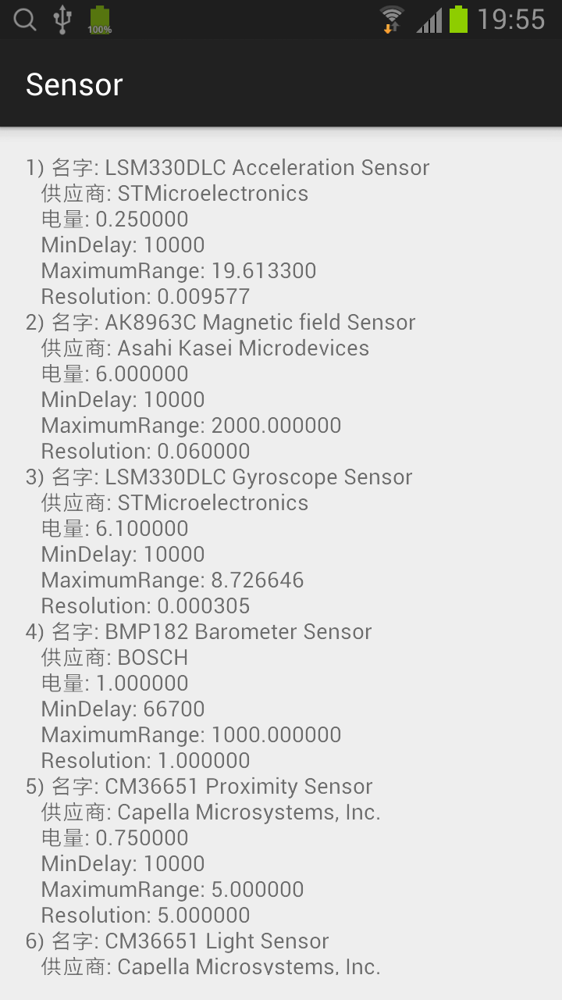

## Sensor 

### 主布局（activity_main.xml）
```xml
<RelativeLayout xmlns:android="http://schemas.android.com/apk/res/android"
    xmlns:tools="http://schemas.android.com/tools"
    android:layout_width="match_parent"
    android:layout_height="match_parent"
    android:padding="@dimen/activity_horizontal_margin"
    tools:context=".MainActivity">

    <ScrollView
        android:layout_width="match_parent"
        android:layout_height="match_parent">
        <TextView
            android:layout_width="match_parent"
            android:layout_height="match_parent"
            android:id="@+id/textView" />
    </ScrollView>

</RelativeLayout>
```

### MainActivity
```java
public class MainActivity extends ActionBarActivity {
    private static final String TAG = "MainActivity";
    private SensorManager sensorManager = null;
    private SensorEventListener accelerometerSensorEventListener = null;

    private class AccelerometerSensorEventListener implements SensorEventListener {
        @Override
        public void onSensorChanged(SensorEvent event) {
            Log.i(TAG, String.format("x:%f, y:%f, z:%f", event.values[0], event.values[1], event.values[2]));
        }

        @Override
        public void onAccuracyChanged(Sensor sensor, int accuracy) {
        }
    }

    @Override
    protected void onCreate(Bundle savedInstanceState) {
        super.onCreate(savedInstanceState);
        setContentView(R.layout.activity_main);

        sensorManager = (SensorManager)getSystemService(Context.SENSOR_SERVICE);
        accelerometerSensorEventListener = new AccelerometerSensorEventListener();

        List<Sensor> sensors = sensorManager.getSensorList(Sensor.TYPE_ALL);

        int i = 1;
        StringBuilder sb = new StringBuilder();
        for (Sensor sensor : sensors) {
            sb.append(String.format("%d) 名字: %s\n", i++, sensor.getName()))
              .append(String.format("\t供应商: %s\n", sensor.getVendor()))
              .append(String.format("\t电量: %f\n", sensor.getPower()))
              .append(String.format("\tMinDelay: %d\n", sensor.getMinDelay()))
              .append(String.format("\tMaximumRange: %f\n", sensor.getMaximumRange()))
              .append(String.format("\tResolution: %f\n", sensor.getResolution()));
        }

        TextView textView = (TextView)findViewById(R.id.textView);
        textView.setText(sb.toString());

        Log.i("examples", sb.toString());
    }

    @Override
    protected void onResume() {
        super.onResume();

        Sensor sensor = sensorManager.getDefaultSensor(Sensor.TYPE_ACCELEROMETER);
        sensorManager.registerListener(accelerometerSensorEventListener, sensor, SensorManager.SENSOR_DELAY_NORMAL);
    }

    @Override
    protected void onPause() {
        super.onPause();

        sensorManager.unregisterListener(accelerometerSensorEventListener);
    }
}
```
* 获得 SensorManager，SensorManager sensorManager = (SensorManager)getSystemService(Context.SENSOR_SERVICE);
* 获得所有的传感器，List<Sensor> sensors = sensorManager.getSensorList(Sensor.TYPE_ALL);
* 读取每个传感器的属性，名字、供应商、电量等。
* 要使用传感器，需要对注册它的 SensorEventListener 事件，onSensorChanged 方法监控值的变化，onAccuracyChanged 方法监控精度的变化。
  * 1. 在 onResume 方法中注册。sensorManager.registerListener(accelerometerSensorEventListener, sensor, SensorManager.SENSOR_DELAY_NORMAL);
  * 2. 在 onPause 方法中注销。sensorManager.unregisterListener(accelerometerSensorEventListener);

