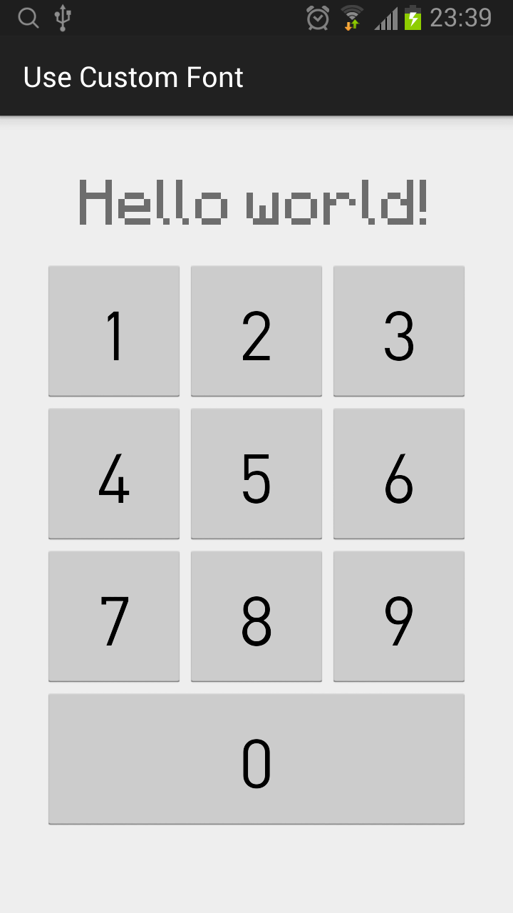

## Use Custom Font

### 1、在项目中的assets目录下增加fonts目录，拷贝字体文件到该目录。
### 2、获得字体。
```java
Typeface tfMinecraft = Typeface.createFromAsset(getAssets(), "fonts/minecraft.ttf");
```
### 3、应用字体。
```java
TextView tvTitle = (TextView)findViewById(R.id.tvTitle);
tvTitle.setTypeface(tfMinecraft);
```

## 字体文件
- 显示标题
- 显示数字

## Snapshot

