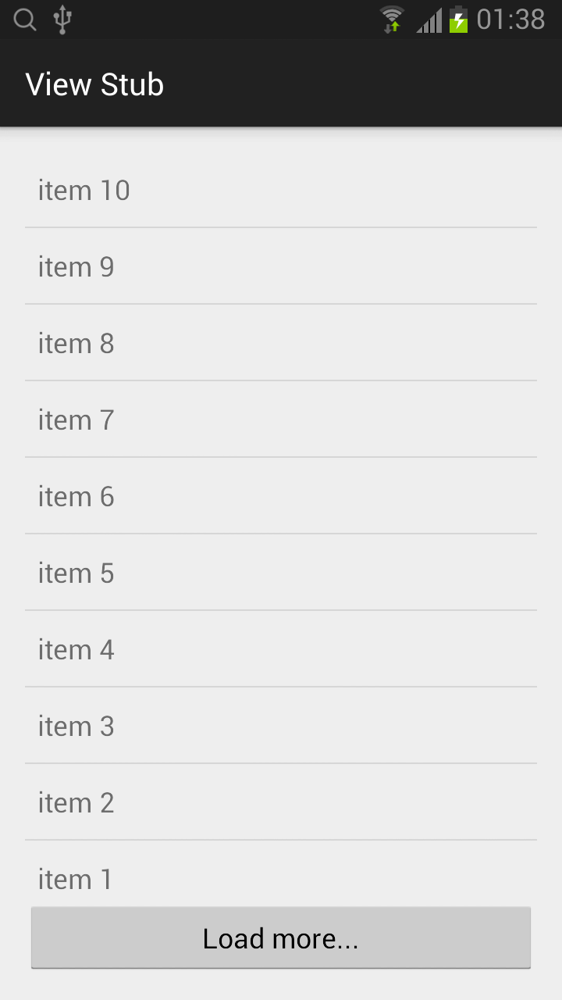

## View Stub

### ViewStub
* 布局需要动态加载，使用 ViewStub。
* 需要定义一个动态加载的布局。
* 动态加载的两种方法：
	* 1. inflate
```java
       ViewStub viewStub = (ViewStub) findViewById(R.id.viewStubLoading);
       View view = viewStub.inflate();
```
  * 2. setVisibility(View.VISIBLE)
```java
       ViewStub viewStub = (ViewStub)findViewById(R.id.viewStubLoading);
       viewStub.setVisibility(View.VISIBLE);
```
* 使用完动态加载的布局，需要移除。viewStub.setVisibility(View.GONE);
  * View.GONE 布局可以隐藏且占用的空间也被收回。


### 下载是模拟加载新闻的实现代码
#### MainActivity
```java
public class MainActivity extends ActionBarActivity {
    private ViewStub viewStub = null;
    private List<String> items = new ArrayList<String>();
    private ArrayAdapter<String> arrayAdapter = null;
    final int count = 10;

    @Override
    protected void onCreate(Bundle savedInstanceState) {
        super.onCreate(savedInstanceState);
        setContentView(R.layout.activity_main);

        addItems(count);

        arrayAdapter = new ArrayAdapter<String>(this, android.R.layout.simple_list_item_1, items);

        ListView listView = (ListView)findViewById(R.id.listView);
        listView.setAdapter(arrayAdapter);
    }

    private void addItems(int count) {
        int begin = items.size();
        int end = items.size() + count;

        for (int i=begin; i<end; ++i)
            items.add(0, String.format("item %d", i+1));
    }

    public void onClickLoadMore(View view) {

        new AsyncTask<Void, Void, Void>() {
            private Button btnLoadMore = null;

            @Override
            protected void onPreExecute() {
                btnLoadMore = (Button)findViewById(R.id.btnLoadMore);
                btnLoadMore.setEnabled(false);

                if (viewStub == null) {
                    viewStub = (ViewStub) findViewById(R.id.viewStubLoading);
                    viewStub.inflate();
//                    or
//                    viewStub = (ViewStub)findViewById(R.id.viewStubLoading);
//                    viewStub.setVisibility(View.VISIBLE);
                }
                else {
                    viewStub.setVisibility(View.VISIBLE);
                }
            }

            @Override
            protected Void doInBackground(Void... params) {
                try {
                    TimeUnit.SECONDS.sleep(2);
                } catch (InterruptedException e) {
                    e.printStackTrace();
                }

                return null;
            }

            @Override
            protected void onPostExecute(Void aVoid) {
                addItems(count);
                arrayAdapter.notifyDataSetChanged();

                viewStub.setVisibility(View.GONE);
                btnLoadMore.setEnabled(true);
            }
        }.execute();
    }

}
```

#### activity_main.xml
```xml
<RelativeLayout xmlns:android="http://schemas.android.com/apk/res/android"
    xmlns:tools="http://schemas.android.com/tools" android:layout_width="match_parent"
    android:layout_height="match_parent" android:paddingLeft="@dimen/activity_horizontal_margin"
    android:paddingRight="@dimen/activity_horizontal_margin"
    android:paddingTop="@dimen/activity_vertical_margin"
    android:paddingBottom="@dimen/activity_vertical_margin" tools:context=".MainActivity">

    <ListView
        android:layout_width="match_parent"
        android:layout_height="wrap_content"
        android:id="@+id/listView"
        android:layout_alignParentTop="true"
        android:layout_alignParentLeft="true"
        android:layout_alignParentStart="true"
        android:layout_above="@+id/btnLoadMore" />

    <Button
        android:layout_width="match_parent"
        android:layout_height="wrap_content"
        android:text="Load more..."
        android:id="@+id/btnLoadMore"
        android:onClick="onClickLoadMore"
        android:layout_alignParentBottom="true"
        android:layout_alignParentRight="true"
        android:layout_alignParentEnd="true"
        android:layout_above="@+id/viewStubLoading"  />

    <ViewStub
        android:layout_width="match_parent"
        android:layout_height="match_parent"
        android:id="@+id/viewStubLoading"
        android:layout="@layout/loading"
        android:inflatedId="@+id/loadingPanel"/>
</RelativeLayout>
```

#### loading.xml
```xml
<?xml version="1.0" encoding="utf-8"?>
<RelativeLayout xmlns:android="http://schemas.android.com/apk/res/android"
    android:orientation="vertical" android:layout_width="match_parent"
    android:layout_height="match_parent">

    <ProgressBar
        style="?android:attr/progressBarStyleLarge"
        android:layout_width="wrap_content"
        android:layout_height="wrap_content"
        android:id="@+id/pbLoading"
        android:layout_centerVertical="true"
        android:layout_centerHorizontal="true" />
</RelativeLayout>
```




