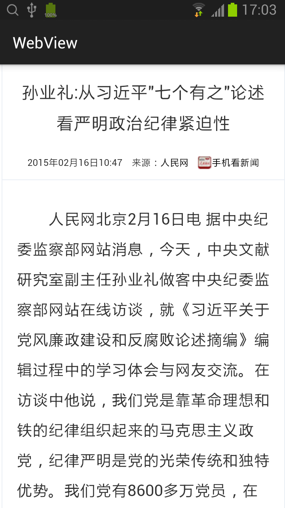
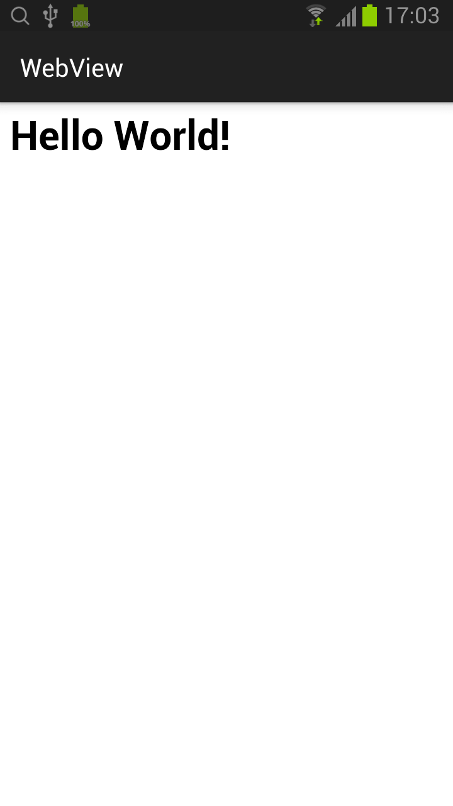
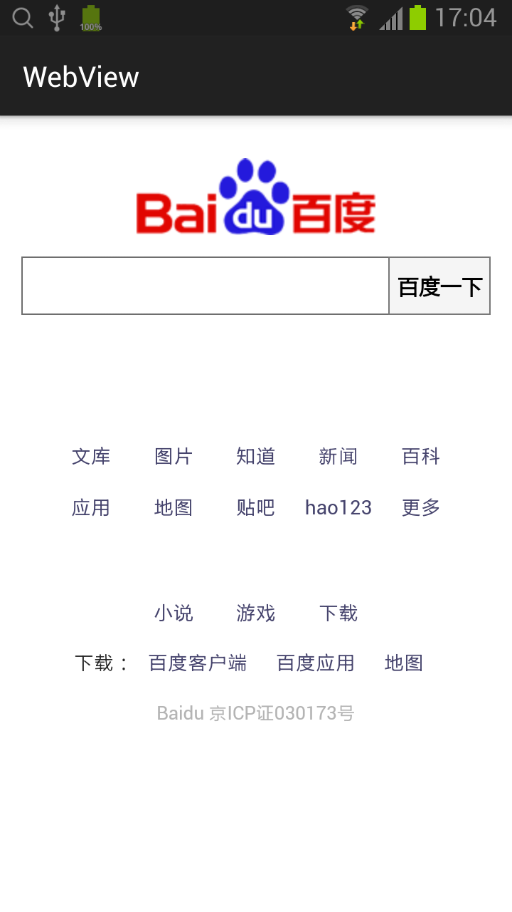
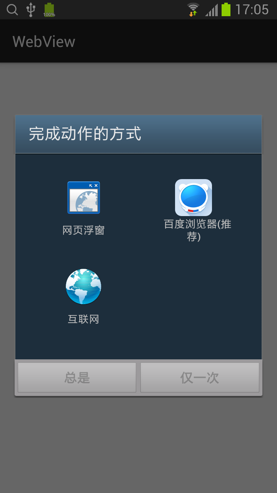
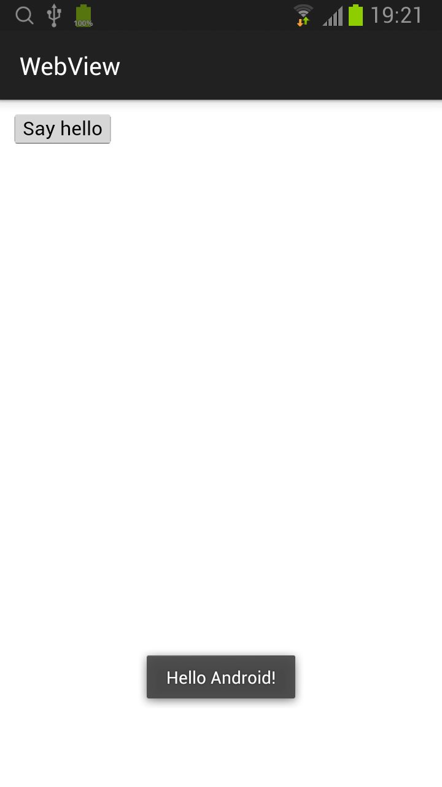

## WebView

### 使用
* 1. 在主布局（activity_main.xml）中增加 WebView 控件。
```xml
<RelativeLayout xmlns:android="http://schemas.android.com/apk/res/android"
    xmlns:tools="http://schemas.android.com/tools"
    android:layout_width="match_parent"
    android:layout_height="match_parent"
    tools:context=".MainActivity">

    <WebView
        android:layout_width="match_parent"
        android:layout_height="match_parent"
        android:id="@+id/webView"/>
</RelativeLayout>
```

* 2. 在 MainActivity 类的 onCreate 函数中加载网页。
```java
    protected void onCreate(Bundle savedInstanceState) {
        super.onCreate(savedInstanceState);
        setContentView(R.layout.activity_main);

        final String url = "http://politics.people.com.cn/n/2015/0216/c1001-26575574.html";

        WebView webView = (WebView)findViewById(R.id.webView);
        webView.loadUrl(url);
    }
```

* 3. 在 AndroidManifest.xml 中增加访问互联网的权限。
```xml
<uses-permission android:name="android.permission.INTERNET"/>
```

### 支持访问网页来源的方式
* 1. 直接加载互联网上的网页。
```java
final String url = "http://politics.people.com.cn/n/2015/0216/c1001-26575574.html";

WebView webView = (WebView)findViewById(R.id.webView);
webView.loadUrl(url);
```


* 2. 加载 assets 目录下的网页。
```java
WebView webView = (WebView)findViewById(R.id.webView);
webView.loadUrl("file:///android_asset/index.html");
```


* 3. 加载动态生成的html。
```java
WebView webView = (WebView)findViewById(R.id.webView);
webView.loadData("<h1>Hello World!</h1>", "text/html", "utf-8");
```


### 支持缩放
```java
WebSettings webSettings = webView.getSettings();
webSettings.setBuiltInZoomControls(true);
```

### 支持重定向。（当加载一个会重定向的页面时，WebView会导致应用程序启动设备的浏览器应用程序来加载所需的页面。）
```java
webView.setWebViewClient(new WebViewClient() {
    @Override
    public boolean shouldOverrideUrlLoading(WebView view, String url) {
        return false;
    }
});
```


* 如果没增加支持重定向将出现下面的提示


### 支持网页历史导航（当用户按回退按键时，可以回退到上一个浏览的网页。）
* 在 MainActivity 类中重载 onKeyDown 方法。
```java
@Override
public boolean onKeyDown(int keyCode, KeyEvent event) {
    if (webView.canGoBack() && keyCode == KeyEvent.KEYCODE_BACK) {
        webView.goBack();
        return true;
    }

    return super.onKeyDown(keyCode, event);
}
```

### 在 WebView 中使用 JavaScript。
1. 在 assets 目录下增加 javascript.html。
```javascript
<input type="button" value="Say hello" onClick="showAndroidToast('Hello Android!')" />

<script type="text/javascript">
    function showAndroidToast(toast) {
        Android.showToast(toast);
    }
</script>
```

2. 绑定 JavaScript 代码到 Android 代码。
```java
public class WebAppInterface {
    Context mContext;

    WebAppInterface(Context c) {
        mContext = c;
    }

    /** Show a toast from the web page */
    @JavascriptInterface
    public void showToast(String toast) {
        Toast.makeText(mContext, toast, Toast.LENGTH_SHORT).show();
    }
}
protected void onCreate(Bundle savedInstanceState) {
    super.onCreate(savedInstanceState);
    setContentView(R.layout.activity_main);

		WebView webView = (WebView)findViewById(R.id.webView);
		WebSettings webSettings = webView.getSettings();
		webSettings.setJavaScriptEnabled(true);
		
		webView.addJavascriptInterface(new WebAppInterface(this), "Android");
		webView.loadUrl("file:///android_asset/javascript.html");
}
```


