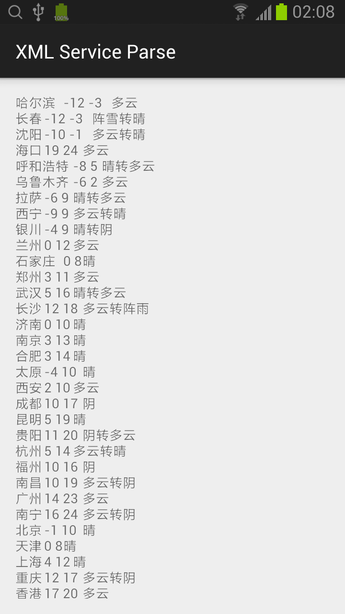

## XML 服务解析

* 1. 在主布局（activity_main.xml）中添加 TextView 控件。
```xml
<RelativeLayout xmlns:android="http://schemas.android.com/apk/res/android"
    xmlns:tools="http://schemas.android.com/tools"
    android:layout_width="match_parent"
    android:layout_height="match_parent"
    android:padding="@dimen/activity_horizontal_margin"
    tools:context=".MainActivity">

    <ScrollView
        android:layout_width="match_parent"
        android:layout_height="match_parent">
        <TextView
            android:layout_width="match_parent"
            android:layout_height="match_parent"
            android:id="@+id/textView" />
    </ScrollView>

</RelativeLayout>
```

* 2. 在 MainActivity 类中编写解析XML服务的代码。
```java
public class MainActivity extends ActionBarActivity {

    @Override
    protected void onCreate(Bundle savedInstanceState) {
        super.onCreate(savedInstanceState);
        setContentView(R.layout.activity_main);

        new ReadXMLTask().execute("http://flash.weather.com.cn/wmaps/xml/china.xml");
    }

    private class ReadXMLTask extends AsyncTask<String, Void, String> {
        @Override
        protected String doInBackground(String... params) {
            String xmlString = downloadText(params[0]);
            return xmlParse(xmlString);
        }

        @Override
        protected void onPostExecute(String s) {
            TextView textView = (TextView)findViewById(R.id.textView);
            textView.setText(s);
        }
    }

    private String downloadText(String urlString) {
        StringBuilder sb = new StringBuilder();

        final int BUF_SIZE = 4096;
        char[] buf = new char[BUF_SIZE];
        int readedLen = 0;

        try {
            InputStream inputStream = openHttpConnection(urlString);
            InputStreamReader reader = new InputStreamReader(inputStream);

            while ((readedLen = reader.read(buf)) > 0) {
                sb.append(new String(buf, 0, readedLen));
            }
        } catch (IOException e) {
            e.printStackTrace();
        }

        return sb.toString();
    }

    private InputStream openHttpConnection(String urlString) throws IOException {
        InputStream inputStream = null;

        URL url = new URL(urlString);
        URLConnection urlConnection = url.openConnection();

        HttpURLConnection httpURLConnection = (HttpURLConnection)urlConnection;
        httpURLConnection.setAllowUserInteraction(false);
        httpURLConnection.setInstanceFollowRedirects(true);
        httpURLConnection.setRequestMethod("GET");

        if (httpURLConnection.getResponseCode() == HttpURLConnection.HTTP_OK) {
            inputStream = httpURLConnection.getInputStream();
        }

        return inputStream;
    }

    /*
        <china dn="nay">
            <city quName="黑龙江" pyName="heilongjiang" cityname="哈尔滨" state1="1" state2="1" stateDetailed="多云" tem1="-12" tem2="-3" windState="微风转西北风小于3级"/>
            <city quName="吉林" pyName="jilin" cityname="长春" state1="13" state2="0" stateDetailed="阵雪转晴" tem1="-12" tem2="-3" windState="北风3-4级转微风"/>
            <city quName="辽宁" pyName="liaoning" cityname="沈阳" state1="1" state2="0" stateDetailed="多云转晴" tem1="-10" tem2="-1" windState="西北风转东北风3-4级"/>
            <city quName="海南" pyName="hainan" cityname="海口" state1="1" state2="1" stateDetailed="多云" tem1="19" tem2="24" windState="微风"/>
            <city quName="内蒙古" pyName="neimenggu" cityname="呼和浩特" state1="0" state2="1" stateDetailed="晴转多云" tem1="-8" tem2="5" windState="东风转南风4-5级"/>
            <city quName="新疆" pyName="xinjiang" cityname="乌鲁木齐" state1="1" state2="1" stateDetailed="多云" tem1="-6" tem2="2" windState="微风"/>
            <city quName="西藏" pyName="xizang" cityname="拉萨" state1="0" state2="1" stateDetailed="晴转多云" tem1="-6" tem2="9" windState="微风"/>
            <city quName="青海" pyName="qinghai" cityname="西宁" state1="1" state2="0" stateDetailed="多云转晴" tem1="-9" tem2="9" windState="微风"/>
            <city quName="宁夏" pyName="ningxia" cityname="银川" state1="0" state2="2" stateDetailed="晴转阴" tem1="-4" tem2="9" windState="微风转南风小于3级"/>
            <city quName="甘肃" pyName="gansu" cityname="兰州" state1="1" state2="1" stateDetailed="多云" tem1="0" tem2="12" windState="微风"/>
            <city quName="河北" pyName="hebei" cityname="石家庄" state1="0" state2="0" stateDetailed="晴" tem1="0" tem2="8" windState="微风转东北风小于3级"/>
            <city quName="河南" pyName="henan" cityname="郑州" state1="1" state2="1" stateDetailed="多云" tem1="3" tem2="11" windState="微风"/>
            <city quName="湖北" pyName="hubei" cityname="武汉" state1="0" state2="1" stateDetailed="晴转多云" tem1="5" tem2="16" windState="微风转北风小于3级"/>
            <city quName="湖南" pyName="hunan" cityname="长沙" state1="1" state2="3" stateDetailed="多云转阵雨" tem1="12" tem2="18" windState="微风"/>
            <city quName="山东" pyName="shandong" cityname="济南" state1="0" state2="0" stateDetailed="晴" tem1="0" tem2="10" windState="微风"/>
            <city quName="江苏" pyName="jiangsu" cityname="南京" state1="0" state2="0" stateDetailed="晴" tem1="3" tem2="13" windState="东风小于3级转东北风3-4级"/>
            <city quName="安徽" pyName="anhui" cityname="合肥" state1="0" state2="0" stateDetailed="晴" tem1="3" tem2="14" windState="东风转东北风3-4级"/>
            <city quName="山西" pyName="shanxi" cityname="太原" state1="0" state2="0" stateDetailed="晴" tem1="-4" tem2="10" windState="微风"/>
            <city quName="陕西" pyName="sanxi" cityname="西安" state1="1" state2="1" stateDetailed="多云" tem1="2" tem2="10" windState="东北风小于3级"/>
            <city quName="四川" pyName="sichuan" cityname="成都" state1="2" state2="2" stateDetailed="阴" tem1="10" tem2="17" windState="南风小于3级"/>
            <city quName="云南" pyName="yunnan" cityname="昆明" state1="0" state2="0" stateDetailed="晴" tem1="5" tem2="19" windState="微风"/>
            <city quName="贵州" pyName="guizhou" cityname="贵阳" state1="2" state2="1" stateDetailed="阴转多云" tem1="11" tem2="20" windState="南风小于3级"/>
            <city quName="浙江" pyName="zhejiang" cityname="杭州" state1="1" state2="0" stateDetailed="多云转晴" tem1="5" tem2="14" windState="东风小于3级转东北风3-4级"/>
            <city quName="福建" pyName="fujian" cityname="福州" state1="2" state2="2" stateDetailed="阴" tem1="10" tem2="16" windState="微风"/>
            <city quName="江西" pyName="jiangxi" cityname="南昌" state1="1" state2="2" stateDetailed="多云转阴" tem1="10" tem2="19" windState="微风"/>
            <city quName="广东" pyName="guangdong" cityname="广州" state1="1" state2="1" stateDetailed="多云" tem1="14" tem2="23" windState="微风"/>
            <city quName="广西" pyName="guangxi" cityname="南宁" state1="1" state2="2" stateDetailed="多云转阴" tem1="16" tem2="24" windState="东南风小于3级"/>
            <city quName="北京" pyName="beijing" cityname="北京" state1="0" state2="0" stateDetailed="晴" tem1="-1" tem2="10" windState="微风"/>
            <city quName="天津" pyName="tianjin" cityname="天津" state1="0" state2="0" stateDetailed="晴" tem1="0" tem2="8" windState="北风3-4级转南风小于3级"/>
            <city quName="上海" pyName="shanghai" cityname="上海" state1="0" state2="0" stateDetailed="晴" tem1="4" tem2="12" windState="东北风小于3级转微风"/>
            <city quName="重庆" pyName="chongqing" cityname="重庆" state1="1" state2="2" stateDetailed="多云转阴" tem1="12" tem2="17" windState="微风"/>
            <city quName="香港" pyName="xianggang" cityname="香港" state1="1" state2="1" stateDetailed="多云" tem1="17" tem2="20" windState="微风"/>
            <city quName="澳门" pyName="aomen" cityname="澳门" state1="1" state2="1" stateDetailed="多云" tem1="16" tem2="22" windState="微风转东北风小于3级"/>
            <city quName="台湾" pyName="taiwan" cityname="台北" state1="2" state2="7" stateDetailed="阴转小雨" tem1="14" tem2="19" windState="微风"/>
            <city quName="西沙" pyName="xisha" cityname="西沙" state1="1" state2="1" stateDetailed="多云" tem1="22" tem2="26" windState="东北风3-4级"/>
            <city quName="南沙" pyName="nanshadao" cityname="南沙" state1="1" state2="1" stateDetailed="多云" tem1="25" tem2="28" windState="东北风4-5级"/>
            <city quName="钓鱼岛" pyName="diaoyudao" cityname="钓鱼岛" state1="0" state2="0" stateDetailed="晴" tem1="13" tem2="15" windState="东北风4-5级"/>
        </china>
     */
    private String xmlParse(String xmlString) {
        StringBuilder sb = new StringBuilder();

        DocumentBuilderFactory dbf = DocumentBuilderFactory.newInstance();
        Document document = null;
        try {
            DocumentBuilder db = dbf.newDocumentBuilder();
            document = db.parse(new InputSource(new StringReader(xmlString)));
        } catch (SAXException e) {
            e.printStackTrace();
        } catch (IOException e) {
            e.printStackTrace();
        } catch (ParserConfigurationException e) {
            e.printStackTrace();
        }

        NodeList citys = document.getElementsByTagName("city");
        for (int i=0; i<citys.getLength(); ++i) {
            Node city = citys.item(i);
            NamedNodeMap attrs = city.getAttributes();

            sb.append(attrs.getNamedItem("cityname").getTextContent()).append("\t")
                    .append(attrs.getNamedItem("tem1").getTextContent()).append(" ")
                    .append(attrs.getNamedItem("tem2").getTextContent()).append("\t")
                    .append(attrs.getNamedItem("stateDetailed").getTextContent()).append("\n");
        }

        return sb.toString();
    }
}
```

* 3. 在 AndroidManifest.xml 中增加 Internet 权限。
```xml
<uses-permission android:name="android.permission.INTERNET"/>
```


