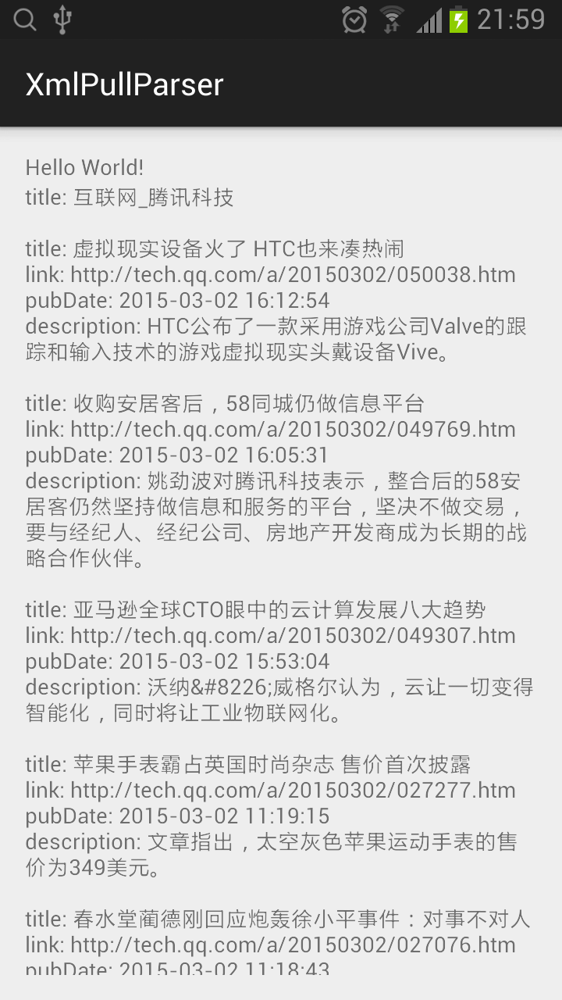

## XmlPullParser

### rss

```xml
<?xml version="1.0" encoding="gb2312"?>
<rss version="2.0">
  <channel>
    <title>互联网_腾讯科技</title>
    <image>
      <title>互联网_腾讯科技</title>
      <link>http://tech.qq.com/</link>
      <url>http://mat1.qq.com/tech/images/tech910img/techc00.gif</url>
    </image>
    <description>互联网_腾讯科技</description>
    <link>http://tech.qq.com/l/web/newtrends/newtrends.htm</link>
    <copyright>Copyright 1998 - 2008 TENCENT Inc. All Rights Reserved</copyright>
    <language>zh-cn</language>
    <generator>www.qq.com</generator>
    <item>
      <title>虚拟现实设备火了 HTC也来凑热闹</title>
      <link>http://tech.qq.com/a/20150302/050038.htm</link>
      <author>www.qq.com</author>
      <category/>
      <pubDate>2015-03-02 16:12:54</pubDate>
      <description>HTC公布了一款采用游戏公司Valve的跟踪和输入技术的游戏虚拟现实头戴设备Vive。</description>
    </item>
    <item>
      <title>亚马逊全球CTO眼中的云计算发展八大趋势</title>
      <link>http://tech.qq.com/a/20150302/049307.htm</link>
      <author>www.qq.com</author>
      <category/>
      <pubDate>2015-03-02 15:53:04</pubDate>
      <description>沃纳&amp;#8226;威格尔认为，云让一切变得智能化，同时将让工业物联网化。</description>
    </item>
    <item>
      <title>苹果手表霸占英国时尚杂志 售价首次披露</title>
      <link>http://tech.qq.com/a/20150302/027277.htm</link>
      <author>www.qq.com</author>
      <category/>
      <pubDate>2015-03-02 11:19:15</pubDate>
      <description>文章指出，太空灰色苹果运动手表的售价为349美元。</description>
    </item>
    <item>
      <title>柴静的雾霾纪录片是怎么火的？</title>
      <link>http://tech.qq.com/a/20150301/020582.htm</link>
      <author>www.qq.com</author>
      <category/>
      <pubDate>2015-03-01 16:28:38</pubDate>
      <description>截止发稿时，《穹顶之下》的播放量早已破亿。</description>
    </item>
  </channel>
</rss>
```

### 解析

```java
    private void parseRSS() {
        StringBuilder sb = new StringBuilder();

        XmlPullParserFactory factory = null;
        try {
            factory = XmlPullParserFactory.newInstance();
            factory.setNamespaceAware(true);
            XmlPullParser xmlPullParser = factory.newPullParser();

            xmlPullParser.setInput(getResources().openRawResource(R.raw.tech_qq_rss_11), "gb2312");

            int eventType = xmlPullParser.getEventType();
            while (eventType != xmlPullParser.END_DOCUMENT) {
                if (eventType == xmlPullParser.START_TAG && xmlPullParser.getName().equals("title")) {
                    sb.append("title: ").append(xmlPullParser.nextText()).append("\n\n");
                } else if (eventType == xmlPullParser.START_TAG && xmlPullParser.getName().equals("item")) {
                    while (!(eventType == xmlPullParser.END_TAG && xmlPullParser.getName().equals("item"))) {
                        if (eventType == xmlPullParser.START_TAG) {
                            if (xmlPullParser.getName().equals("title")) {
                                sb.append("title: ").append(xmlPullParser.nextText()).append('\n');
                            } if (xmlPullParser.getName().equals("link")) {
                                sb.append("link: ").append(xmlPullParser.nextText()).append('\n');
                            } if (xmlPullParser.getName().equals("pubDate")) {
                                sb.append("pubDate: ").append(xmlPullParser.nextText()).append('\n');
                            } if (xmlPullParser.getName().equals("description")) {
                                sb.append("description: ").append(xmlPullParser.nextText()).append('\n');
                            }
                        }

                        eventType = xmlPullParser.next();
                    }

                    sb.append('\n');
                }
                else if (eventType == xmlPullParser.START_TAG && xmlPullParser.getName().equals("image")) {
                    while (!(eventType == xmlPullParser.END_TAG && xmlPullParser.getName().equals("image"))) {
                        eventType = xmlPullParser.next();
                    }
                }

                eventType = xmlPullParser.next();
            }

        } catch (XmlPullParserException e) {
            e.printStackTrace();
        } catch (IOException e) {
            e.printStackTrace();
        }
        
        tvRSS.setText(sb.toString());
    }
```


